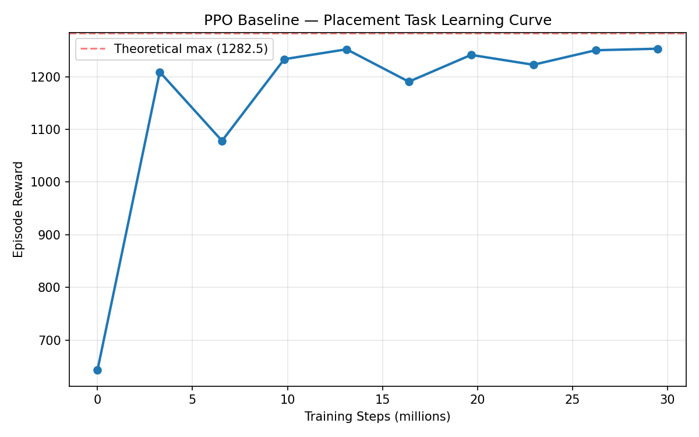

# Phase 1 Report: Placement-Only Environment & Baseline PPO

## 1. Environment Design

`PandaPlaceCube` inherits from `PandaPickCube` (MuJoCo Playground) with the following modifications:

| Component | PandaPickCube (original) | PandaPlaceCube (ours) |
|-----------|------------------------|-----------------------|
| XML | `mjx_single_cube.xml` | `mjx_single_cube_camera.xml` |
| Keyframe | `"home"` (box on table, gripper open) | `"picked"` (box in gripper) |
| Target location | In the air (z: 0.2–0.4) | On the table (z = 0.03) |
| Target center | box default pos [0.7, 0, 0.03] | [0.55, 0.0, 0.03] (offset from box start) |
| Target range | ±0.2m | ±0.1m |
| `gripper_box` reward | Yes (weight 4.0) | Removed |
| `reached_box` latch | Yes (gates `box_target` reward) | Removed |
| `_get_obs` | 67 dims (includes rotation error) | Inherited from parent (66 dims) |

Key design decisions:
- Used the library's built-in `"picked"` keyframe rather than manually computing gripper coordinates.
- Removed `gripper_box` reward because the box starts already grasped 
- Removed `reached_box` latch because the box is in the gripper from step 0 
- Target z is set to 0.03m (half the box height of 0.06m), as `distance_to_table = box_center_pos - target_pos`

## 2. Reward Function

`R_t = w1 * R_place + w2 * R_floor + w3 * R_pose`

| Term | Formula | Weight | Purpose |
|------|---------|--------|---------|
| R_place | `1 - tanh(5 * d_t)` | 8.0 | Box-to-target distance |
| R_floor | `1` if no hand-floor contact, else `0` | 0.25 | Prevent gripper collision with floor |
| R_pose | `1 - tanh(norm(q_arm - q_home))` | 0.3 | Keep arm near home pose |

where `d_t = norm(box_pos - target_pos)` is the Euclidean distance between box center and target.

Theoretical maximum per step: 8.0 + 0.25 + 0.3 = 8.55

Theoretical maximum per episode (150 steps): 8.55 * 150 = 1282.5

## 3. Hyperparameters

All values are taken from MuJoCo Playground's default PPO configuration for `PandaPickCube`.

| Parameter | Value |
|-----------|-------|
| Algorithm | PPO (Brax implementation) |
| Total timesteps | 20,000,000 |
| Parallel environments | 2,048 |
| Batch size | 512 |
| Minibatches | 32 |
| Updates per batch | 8 |
| Unroll length | 10 |
| Discount factor | 0.97 |
| Learning rate | 1e-3 |
| Entropy coefficient | 0.02 |
| Reward scaling | 1.0 |
| Observation normalization | Yes |
| Policy network | 4 layers, 32 units each |
| Value network | 5 layers, 256 units each |
| Episode length | 150 steps |
| Control dt | 0.02s (50 Hz) |
| Simulation dt | 0.005s (200 Hz) |
| Action scale | 0.04 |

## 4. Learning Curve

Training completed in ~99 seconds on an NVIDIA RTX 5070 Ti (16 GB).

- Reward rises sharply in the first 3M steps (563 → 1149), indicating rapid initial learning.
- Converges to ~1250 by 10M steps and remains stable.
- Final reward: **1253.28 / 1282.5 = 97.7%** of theoretical maximum.
- Throughput: ~297,000 env-steps/sec.

## 5. Results and Observations

The agent successfully learns to place the box at the target location on the table. The target is centered at [0.55, 0.0, 0.03] — offset from the box's starting position [0.637, 0.006] — with ±0.1m randomization, requiring the agent to actively move the arm rather than simply releasing the box.

A benchmark of 6 target configurations confirmed that the agent can learn placement across a range of positions within the arm's workspace:

| Config (Offset, Target position) | Target Center | Range | Reward |
|--------|--------------|-------|--------|
| Fixed, directly below | [0.637, 0.006] | 0 | 1265 |
| Below + random | [0.637, 0.006] | ±0.15 | 1238 |
| Offset x, fixed | [0.55, 0.0] | 0 | 1246 |
| **Offset x + random** | **[0.55, 0.0]** | **±0.1** | **1253** |
| Offset y, fixed | [0.637, 0.15] | 0 | 1173 |
| Offset x+y, fixed | [0.5, 0.1] | 0 | 1219 |

The target center and randomization range must be chosen carefully. An early configuration (center [0.3, 0.3] with ±0.3 range) caused training to degrade significantly (reward ~470), because extreme target positions (e.g., [0.6, 0.6] at 0.85m from base) approached or exceeded the arm's physical reach of ~0.855m, introducing infeasible episodes that degraded training.

The current baseline uses a simple distance-based reward without any visual or goal-conditioning signal. Phase 2 will introduce mask-based goal conditioning to enable placement at more diverse target locations and to guide the agent's trajectory rather than relying solely on the distance reward.
